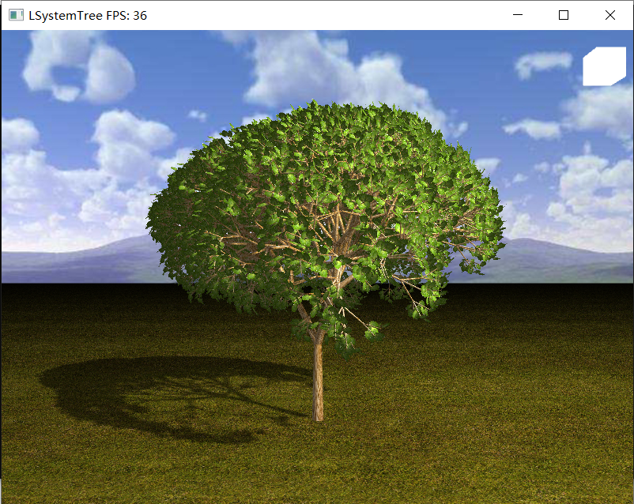
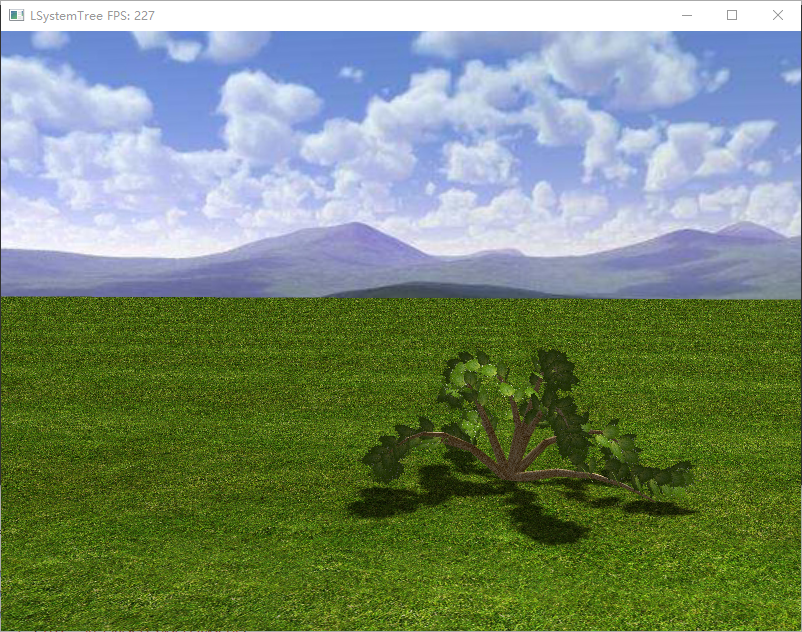
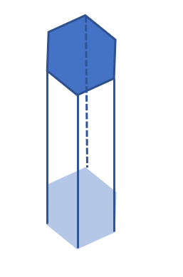
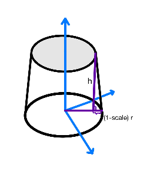
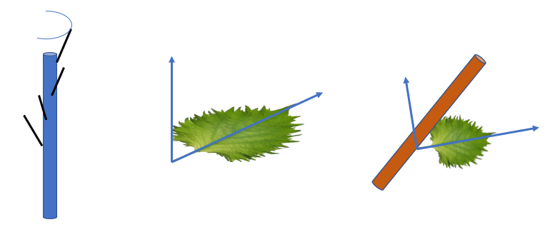
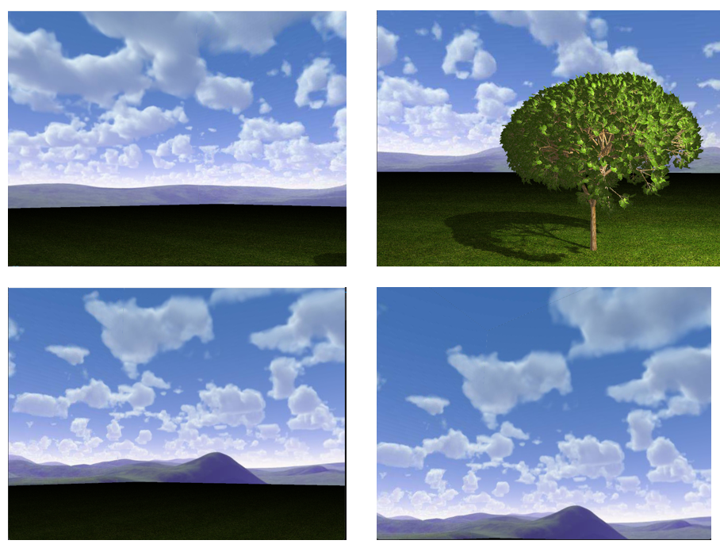
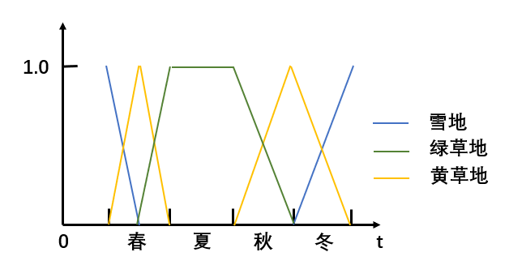

<p style="text-align:center; font-size:30px">计算机图形学期末项目：L-System Tree</p>
<p style="text-align:center; font-size:20px">第一小组</p>

## 项目介绍

我们实现的L-System Tree项目结构如下：

```
/LSystemTree
|-- header file
|   |-- camera.h
|   |-- Cone.h
|   |-- data.h
|   |-- grammar.h
|   |-- LSystemTree.h
|   |-- ParticleSystem.h
|   |-- shader.h
|   |-- stb_image.h
|   |-- util.h
|-- src
|   |-- main.cpp
|   |-- util.cpp
|-- shaders
|-- |...
```

基本功能有：

* **L-system文法**：构建随机三维L-system文法，从一根树干产生分支
* **纹理**：从L-system产生的分支构建出树，为树干、枝条和叶子附上纹理
* **天空盒背景**：场景的背景用立方体贴图表示，地面用一个平面表示
* **传统光照**：实现了Blinn-Phong传统光照模型
* **阴影**：使用Shadow map技术为树增加阴影轮廓
* **交互摄像机**：实现第三人称摄像机，可以自由移动
* **四季更换**：树叶和地面的纹理随时间流逝更换，产生一年四季变化的效果
* **简单粒子模型**：实现了雪花飘落这一简单粒子模型

实现的效果如下：



上图的配置：

起始字符串："S"

规则：`S -> F[^X][%X][&%X]`
`X -> F[^%D][&D][/D][%D]、F[&%D][D][/D][^%D]`
`D -> F[^X][**%FX][&%X]`

iter = 8, init_len=0.4f, init_radius=0.4f, radius_dec_scale = 0.7f, len_dec_scale = 0.8f, angle = 30.0f.



上图的配置：

起始字符串：“S”

规则：`S->[**$X][*%Y][&%Z][//$O][/$$P][**$Z][^$$P][&&$Y][///%X]`
`X->F[^XL]`
`Y->F[&YL]`
`Z->F[*ZL]`
`O->F[/OL]`
`P->F[^PL]`

iter = 8, init_len=0.3f, init_radius=0.4f, radius_dec_scale = 0.7f, len_dec_scale = 0.7f, angle = 25.0f.

代码的配置可以参考opengl的中文文档。可以在 `main.cpp`顶部的全局变量和 `generate_LSystemTree()`中修改L-System Tree的参数。

## 功能介绍

### 文法生成器

Lindenmayer 系统（简称为L-系统），是一种字符串迭代重写机制，被认为是植物生长的数学理论。其核心概念是重写，也成为迭代重写,通过应用一个重写规则或产生式的集合，对简单的初始目标中的部分（可以是一部分也可以是多个部分）进行连续置换来定义复杂目标的技术。在L-系统中，产生式是并行地、同时替换所给字符串中的所有字符，这种区别反映了L-系统的生物学动机。

**文法生成器的构建**

```cpp
int level;
string start;
string result;
unordered_map<char, vector<string>> rules;
```

变量的含义如名。level：迭代级别。start：生成过程的起始字符串。result：生成过程的结果字符串。rules：一个从字符映射到字符串列表的无序映射（哈希表），用于存储替换规则。通过 `set_level(int i)`, `set_start(string s)`, `set_result(string s)`：分别用于设置 `level`、`start` 和 `result` 的值。`add_rule(char c, string s)`：为字符 `c` 添加一个替换规则 `s`。如果 `c` 已经有相关的替换规则，则这个规则会被添加到该字符的规则列表中。

**生成函数 `generate()`**

根据规则和起始字符串生成结果字符串。`result` 初始设置为 `start`，遍历 result 中的每个字符，

* 如果 `rules` 中存在 `c` 的替换规则，则从规则列表中随机选择一个规则，并将其添加到 `temp`。
* 如果没有替换规则，则字符 `c` 保持不变，并直接添加到 `temp`。

为了实现随机性，可对于同一个非终结符Vt有不同的产生式，每次应用迭代过程都要从中随机选取一个表达式生成。即通过 `int index = rand() % rules[c].size();`来设置随机L系统。

```cpp
void generate(){
    result = start;
    for(int i = 0; i < level; i++) {
        string temp = "";
        for(auto c : result){
            if(rules.find(c) != rules.end()){
                int index = rand() % rules[c].size();
                temp += rules[c][index];
            }
            else {
                temp += c;
            }
        }
        result = temp;
    }
}
```

例如，给定起始字符串为 `"AB"`，规则有 `"A"->"AB","B"->"BAB"`，那么迭代一次后生成字符串 `"ABBAB"`，迭代两次后生成字符串 `"ABBABBABABBAB"`，以此类推可见这种生成规则能生成庞大而具有相似模式的字符串。

### 语法解析器

`LSystemTree.h`完成语法解析的过程。在文法生成器给定起始字符串和生成规则，迭代若干次后就能得到一个新的字符串，语法解析器就要将这个新的字符串解析为树的结构。树包含树干、树叶以及分支，树干之间存在夹角。为了模拟自然的效果，我们规定解析规则如下：

* 字符'F'：代表在当前的”状态“下生成树干，树干的形态和数据结构在后面介绍；
* 字符'$'和'%'：分别代表绕y轴正/负方向旋转一定角度；
* 字符'^'和'&'：分别代表绕x轴正/负方向旋转一定角度；
* 字符'*'和'/'：分别代表绕z轴正/负方向旋转一定角度；
* 字符'['：将当前状态保存到栈顶，相当于树干的分支点；
* 字符']'：将当前的状态变为栈顶的状态，相当于树干延伸一定数目后回到原来的分支点。

我们可以观察到在现实生活中，随着树干的延伸，半径和长度都在逐渐减小。因此将树干建模为圆台。另外，树叶一般都分布在最短的、也就是迭代层数最深的枝条上，因此规定树叶就在栈层次最高的位置生成。“状态”的数据结构定义如下，里面变量含义如名：

```cpp
struct state {
	glm::vec3 pos; // 当前位置
	glm::vec3 dir; // 延伸方向
	float len; // 下一级树干的长度
	float radius; // 当前圆台下底面半径
	int level; // 当前栈层次
};
```

定义语法解析器类如下：

```cpp
class LSystemTree
{
public:
    state cur_state; // 当前状态
    vector<Trunk> trunks; 
    vector<Leaf> leafs;
    float radius_dec_scale; // 树干半径衰减系数
    float len_dec_scale; // 树干长度衰减系数
    float ori_radius; // 树干初始半径
    float ori_len; // 树干初始长度
    float angle; // 旋转角度
    ...
}
```

那么给定已生成的句法，语法解析的过程如下：

```cpp
void generate(const Grammar& g)
    stack<state> state_stack
    result = g.get_result();
    for(c: result){
        if c == 'F':
            创建 树干 trunk
	    设定trunk参数
            将 trunk 添加到 树干容器 trunks 中
	    更新当前状态
        else if c == '$':
            更新 cur_state 的方向，绕 y 轴正方向旋转指定角度
        else if c == '%':
            更新 cur_state 的方向，绕 y 轴负方向旋转指定角度
        else if c == '^':
            更新 cur_state 的方向，绕 x 轴正方向旋转指定角度
        else if c == '&':
            更新 cur_state 的方向，绕 x 轴负方向旋转指定角度
        else if c == '*':
            更新 cur_state 的方向，绕 z 轴正方向旋转指定角度
        else if c == '/':
            更新 cur_state 的方向，绕 z 轴负方向旋转指定角度
        else if c == '[':
            将当前状态保存到 state_stack 中
            更新 cur_state 的长度和半径，以及增加层级
        else if c == ']':
            如果 cur_state 的层级等于 g 的迭代层数，则：
                获取最近生成的树干 t
                在 t 的结束点生成一个叶子 leaf
                将 leaf 添加到 叶子容器 leafs 中
            恢复为栈顶保存的状态信息
    }
}
```

### 树干渲染

树干是由圆台不断分支构成的，所有的树干都是由一个母圆台经过旋转、伸缩和平移变换得到的。首先需要得到母圆台。

母圆台的构造是通过上下两个近似圆的正多边形和侧面的多个矩形围成的，如下所示就是由正六边形近似的圆柱：



当上下底面的边数 `sectorCount`提高时，近似圆的效果就会越好。

因为我们在后面要实现光照，所以需要在着色器中给出一个面片的法向量；为了附上纹理，还需要给出纹理坐标。

一个圆台平放在世界空间时，其上下底面的法向量是容易求的，分别是 `(0,1,0)`和 `(0,-1,0)`。假设圆台的上底面半径是下底面半径 `r` 的 `scale`倍（实际上，为了简化，令下一级圆台的下底面半径等于当前圆台上底面半径），那么其侧面矩形的法向量在三个维度都会有分量，如下所示：



可以求出圆台母线与垂线的夹角为$\phi = \arctan \frac{(1-scale)r}{h}$，因此母线在底面的交点与圆心的连线 与x轴的夹角为$\theta$时，可以得出母线上点的法向量为$(\cos(\theta)\cos(\phi),\ \sin(\phi),\ \sin(\theta)\cos(\phi))$。均匀地取$\theta$遍历底面圆周时，就能获得侧面矩形4个点的世界空间坐标、法向量、纹理坐标。具体的实现细节在 `Cone.h`中。

树干的数据结构为：

```cpp
struct Trunk {
    glm::vec3 start; // 圆台底面中心坐标
    glm::vec3 end; // 圆台顶面中心坐标
    float radius_scale; // 当前圆台底面半径与母圆台底面半径之比
    float len_scale; // 当前圆台长度与母圆台长度之比
};
```

在 `main.cpp`中，`renderTree`利用语法解析后生成的 `trunks`渲染树，代码如下：

```cpp
void renderTree(const Shader& shader, size_t len) {
    glBindVertexArray(treeVAO);
    auto& trunks = l.get_trunks();
    for (unsigned int i = 0; i < trunks.size(); i++) {
        glm::mat4 model = GetTrunkModelMat(trunks[i].start, trunks[i].end, trunks[i].radius_scale, trunks[i].len_scale);
        shader.setMat4("model", model);
        glDrawArrays(GL_TRIANGLES, 0, len);
    }
}
```

其中 `GetTrunkModelMat`获取当前trunk的模型矩阵，这样只需要改变模型矩阵就能实现**着色器的复用**，效率很高。这个思想在渲染树叶和雪花部分也会用到。值得注意的是 `GetModelMat`函数中对半径和高的缩放倍数是不一样的，先对x和z轴缩放 `radius_scale`倍，对y轴缩放 `len_scale`倍，然后再进行旋转、平移，得到模型矩阵。

### 树叶渲染

`main.cpp`中的函数 `renderLeaf`完成渲染树叶的工作。

在利用生成的文法构建L-system树时，树叶一般会在迭代最高层的枝条上生成。在我们实现的树中，树叶是包含树叶图片的正方形。树叶的渲染问题本质上就是树叶的放置和树叶的纹理。为了让一个枝条上的树叶分布更均匀，使整体效果更匀称，将树叶均匀地绕枝条放置，并且树叶叶脉方向与树枝方向成45°，法向朝向树枝，如下图所示：



所以树叶放置就是要将初始的树叶经过旋转平移后到达对应的位置。

树叶的数据结构如下：

```cpp
struct Leaf {
	glm::vec3 pos; // 迭代最高层树干末端坐标
	glm::vec3 dir; // 树干延伸方向
	float len; // 下一级树干的长度
};
```

要让树叶均匀地绕枝条分布，那么就要先均匀地获得树枝方向的法向量 `nor`。可以先获取两个相互垂直的法向量：

$$
nor1 = (-dir.y, dir.x, 0)\\
nor2 = normalize(dir\times nor1)
$$

，然后均匀取$\theta\in[0,2\pi)$以及$nor=nor1*\sin(\theta)+nor2*cos(\theta)$即可。

然后是旋转，本质上是通过两次旋转让两条轴$axis1=(0.5,0,0.5),axis2=(0,1,0)$分别到达目标方向$tar1=dir+nor,tar2=dir-nor$，对应了两个旋转矩阵。这里需要注意的是这两条轴是耦合的，也就是旋转某一条轴时另一条轴也会变化，因此求第二条轴的旋转矩阵前，其应该先按照第一条轴的方式旋转，如下所示：

```cpp
glm::mat4 rotas_mat1 = glm::rotate(mat, glm::angle(axis1, tar1), glm::cross(axis1, tar1));
axis2 = glm::vec3(rotas_mat1 * axis2);
glm::mat4 rotas_mat2 = glm::rotate(mat, glm::angle(axis2, tar2), glm::cross(axis2, tar2));
rotas_mat = rotas_mat2*rotas_mat1;
```

渲染树叶纹理时，因为会涉及到纹理的混合，所以在片段着色器中传入两个纹理，并传入 `leaf_mix_rate`来控制比例。另外，因为包含树叶的正方形图像必然会有冗余的部分，所以树叶使用png格式的图像，在非叶部分的alpha通道值为0，在片段着色器进行判断，如果alpha通道小于某个阈值，就丢弃，不渲染这个像素，这种做法会在渲染雪花时也用到。

```cpp
...
void main(){
    color = ...
    if(color.a<0.01f){
	discard;
    }
...
}
```

### 天空盒背景

先创建立方体贴图，立方体贴图是一种纹理映射技术，由六个面组成，每个面都是一个2D纹理，常用于模拟环境映射和天空盒，可以通过一个方向向量来进行索引/采样，只要提供了方向，OpenGL就会获取方向向量（最终）所击中的纹素，并返回对应的采样纹理值。


为立方体贴图中的每个面生成一个纹理。其中将环绕方式设置为 `GL_CLAMP_TO_EDGE`，这是因为正好处于两个面之间的纹理坐标可能不能击中一个面，所以通过使用GL_CLAMP_TO_EDGE，纹理坐标的边缘值将被延伸，这可以防止在立方体贴图的边缘处产生不希望的缝隙。

```cpp
for (unsigned int i = 0; i < faces.size(); i++) {
    unsigned char* data = stbi_load(faces[i].c_str(), &width, &height, &nrChannels, 0);
    if (data) {
        glTexImage2D(GL_TEXTURE_CUBE_MAP_POSITIVE_X + i,
                     0, GL_RGB, width, height, 0, GL_RGB, GL_UNSIGNED_BYTE, data);
    }
    else {
        printf("Failed to load cubemap texture\n");
    }
    stbi_image_free(data);
}
glTexParameteri(GL_TEXTURE_CUBE_MAP, GL_TEXTURE_WRAP_S, GL_REPEAT);
glTexParameteri(GL_TEXTURE_CUBE_MAP, GL_TEXTURE_WRAP_T, GL_REPEAT);
glTexParameteri(GL_TEXTURE_CUBE_MAP, GL_TEXTURE_WRAP_R, GL_REPEAT);
glTexParameteri(GL_TEXTURE_CUBE_MAP, GL_TEXTURE_MIN_FILTER, GL_LINEAR);
glTexParameteri(GL_TEXTURE_CUBE_MAP, GL_TEXTURE_MAG_FILTER, GL_LINEAR);
```

用于贴图3D立方体的立方体贴图可以使用立方体的位置作为纹理坐标来采样。当立方体处于原点(0, 0, 0)时，它的每一个位置向量都是从原点出发的方向向量。这个方向向量正是获取立方体上特定位置的纹理值所需要的。正是因为这个，我们只需要提供位置向量而不用纹理坐标了。

顶点着色器通过一个技巧（设置 `gl_Position`的z分量等于w分量）确保天空盒始终在场景中的最远处渲染，从而不会被其他场景元素遮挡。这里用 `pos.xyww`而不是通常的 `pos`，是为了保证天空盒始终位于其他所有物体的背后。将z值设置为与w值相同可以达到这个效果，因为深度值（z/w）将始终等于1，也就是深度缓冲区的最大值。同时，通过 `glDepthFunc(GL_LEQUAL);`，改变了深度测试的方式如果片段的深度值小于或等于深度缓冲区中的值，则通过深度测试，从而天空盒总是被渲染在其他物体的背后。

```cpp
void main()
{
    TexCoords = aPos;
    vec4 pos = projection * view * vec4(aPos, 1.0);
    gl_Position = pos.xyww;
}
```

其中 `glm::mat4 view = glm::mat4(glm::mat3(camera.GetViewMatrix()));`不包含平移分量的视图矩阵。这样做是为了确保天空盒看起来像在无限远处，不随相机位置变化而变化。

生成效果如下：



### 传统光照

在本次项目中，使用了 `Blinn-Phong`光照模型，包括环境光系数的设置，剩余的可以分为以下部分：

漫反射

$$
ambient=\boldsymbol L \cdot \boldsymbol {normal}
$$

半程向量的镜面反射，(L-lightDir，V-viewDir)：

$$
\boldsymbol{H}=\frac{\boldsymbol L+ \boldsymbol V}{||\boldsymbol L+ \boldsymbol V||},\ \ spec=\boldsymbol H\cdot \boldsymbol{normal}
$$

光的衰减：

$$
attenuation=\frac{1}{c+b\cdot d+a\cdot d^2}
$$

其中 `d`为光源到片段的距离。光照实现在负责渲染树叶和地面的 `mixshader.fs`片段着色器和负责渲染树干的 `shader.fs`片段着色器中。两个实现基本相同，实现如下功能，具体可参照 `shader.fs`：

```cpp
// From 
// "shader.fs"

uniform vec3 shadowMap

    // 设置参数如环境光强度，镜面反射强度，光的衰减系数
    float ambientStrength = 0.5f;
    //......

    // 环境光部分
    vec3 ambient = ambientStrength * lightColor;
    // 漫反射部分
    float diff = max(dot(normal, lightDir), 0.0f);
    vec3 diffuse = diff * lightColor;

    // 使用半程向量计算镜面反射部分
    // ......

    // 光的衰减部分
    float d = distance(lightPos, fs_in.FragPos);

    //float attenuation = 1.0f / (attenuation_x + attenuation_y * d + attenuation_z * pow(d, 2));

    float attenuation = 1.0f;

    // lighting = ambient + attenuation * (diffuse + specular);
```

到这里，你可能察觉着色器实际的实现和我们上面提到的 `Blinn-Phong`模型有些不一样，在光照衰减部分，我们给 `attenuation`规定了一个恒定的值 `1.0f`。

这是因为我们想要模仿太阳光的效果：太阳光是平行光，而且在人眼可见的范围内，其强度不随距离的变化而变化。

关于对太阳光有意识的模拟，会贯穿于整个光照和阴影的处理中，比如下面就是了。

为了处理光照，我们相应地规定片段着色器输入和输出如下：

```cpp
// From
// "shader.fs"

out vec4 FragColor

in VS_OUT {
    vec3 FragPos;
    vec3 nor;
    vec2 TexCoord;
    vec4 FragPosLightSpace;
} fs_in;

uniform vec3 viewPos;
// uniform vec3 lightPos;
uniform vec3 lightColor;
uniform sampler2D diffuseTexture;
uniform sampler2D shadowMap;
uniform bool shadows;
uniform vec3 lightDir;
uniform float lightStrength;
```

其中，`FragPos`是片段的位置，`nor`是片段的法向量方向，`TexCoord`是纹理坐标，`FragPosLightSpace`则是在后面渲染阴影时需要使用到的片段在光照坐标中的位置。

对于 `uniform`项，大部分意如其名，而之所以禁用掉 `lightPos`是因为我们在本次实验中使用平行光模拟太阳光，不需要光源位置。剩余的 `shadowMap`和 `shadows`用于后续提到的阴影渲染。`lightStrength`用于后续提到的光源的移动和光照强度的改变.

只需要按照着色器灌顶，正确传入相关量，即可完成传统光照的渲染。

### 阴影

在本项目中，我们使用 `Shadow Map`，即阴影贴图技术进行阴影的渲染。

使用本技术的前置技术是帧缓冲的相关概念和技术，我们需要定义自己的帧缓冲，并且创建一个用于存放深度信息的纹理附件附加到帧缓冲上，用于深度贴图的渲染。

上述提到的步骤以的代码实现可参照 `main.cpp`：

```cpp
// From
// "main.cpp"
// before render loop

    // 创建了一个帧缓冲
    unsigned int depthMapFBO;
    glGenFramebuffers(1, &depthMapFBO);
    //.....

    // 创建一个纹理附件
    // 纹理用于存放深度缓冲的渲染结果
    unsigned int depthMap;
    glGenTextures(1, &depthMap);
    //......

    // 将纹理附件附加到我们创建的帧缓冲上
    // 同时禁用颜色缓冲，只保留深度信息
    glBindFramebuffer(GL_FRAMEBUFFER, depthMapFBO);
    glFramebufferTexture2D(GL_FRAMEBUFFER, GL_DEPTH_ATTACHMENT, GL_TEXTURE_2D, depthMap, 0);
    //......
```

#### 深度贴图的渲染

接下来渲染深度贴图的渲染，需要一个光照空间矩阵，以及对应的深度贴图着色器。
深度贴图着色器区别于普通着色器，在其顶点着色器部分，他返回的是顶点在光照空间内的坐标，而不是摄像机坐标空间。而其片段着色器也不同，因为其不需要执行任何操作，只需交由系统自动填充。具体参见 `depthShader.vs`和 `depthShader.fs`。
为了使深度贴图着色器正确运行，我们需要在 `main.cpp`的渲染循环中进行光照空间矩阵的计算——因为在我们的设计中，每次循环都会改变光源的位置。

```cpp
// From
// "main.cpp"

// render loop
// 渲染深度贴图

        // 决定一个长宽为20，近平面为1，远平面为7.5的视椎体
        // 实际上是一个立方体，因为我们把光设置为平行光
        lightProjection = glm::ortho(-10.0f, 10.0f, -10.0f, 10.0f, near_plane, far_plane);

        // 光源的观察向量
        // 从光源的位置指向(0,0,0)
        lightView = glm::lookAt(lightPos, glm::vec3(0.0f), glm::vec3(0.0, 1.0, 0.0));

        // 类似观察空间矩阵，这是光线空间矩阵
        lightSpaceMatrix = lightProjection * lightView;

        // 将计算出来的光照矩阵传递到深度贴图着色器中
        depthShader.use();
        depthShader.setMat4("lightSpaceMatrix", lightSpaceMatrix);
```

之后，就可以使用深度贴图着色器进行深度贴图的渲染了：

```cpp
// From
// "main.cpp"

// render loop

        renderTree(depthShader, vertices.size());
        renderGround(depthShader);
        renderLeaf(depthShader, sizeof(leafVertices), leaf_mix_rate, scale, height_offset);
```

值得注意的是，在使用我们的帧缓冲以渲染深度贴图时，记得需要进行帧缓冲的绑定和解绑操作，不然会导致视觉效果的错误，以及阴影贴图的差错，详细参见 `main.cpp`。

#### 阴影渲染

在经过上述过程之后，我们完成了深度贴图的渲染，接下来就可以将深度贴图用于阴影的渲染。
以树干的渲染为例，我们在普通渲染过程的基础上加入我们渲染阴影需要的操作：

```cpp
// From
// "main.cpp"

// render loop

        // render trunks
        // ......
        trunkShader.setMat4("lightSpaceMatrix", lightSpaceMatrix);
        trunkShader.setBool("shadows", shadows);
        trunkShader.setVec3("lightDir", parallei_light);
        // ......
        glActiveTexture(GL_TEXTURE1);
        glBindTexture(GL_TEXTURE_2D, depthMap);
        renderTree(trunkShader, vertices.size());
```

另外，我们在片段着色器中加入我们实际计算阴影的函数。该函数中应用了相关的操作，解决了阴影映射中一些导致阴影渲染不正确的问题，比如阴影失真，以及阴影锯齿，还有采样过多，具体参见 `shader.fs`：

```cpp
// From
// “shader.fs”

float ShadowCalculation(vec4 FragPosLightSpace){
    // 获取深度贴图中的深度，以及当前深度
    // ......

    // 应用bias，以避免阴影失真
    float bias = max(0.01 * (1.0 - dot(fs_in.nor, lightDir)), 0.001);
    float shadow = 0.0f;
  // 应用pcf，对阴影贴图中的相邻像素进行采样，以缓解阴影锯齿
  vec2 texelSize = 1.0 / textureSize(shadowMap, 0);
     // ......

  // 避免采样过多
  if(projCoords.z > 1.0f)
  // ......
}
```

另外还存在一个悬浮(peter panning)的问题，这需要在渲染循环中运用面剔除技术进行解决：

```cpp
glCullFace(GL_FRONT);
//......
glCullFace(GL_BACK);
```

具体可以参照 `main.cpp`。

至此，我们就完成了阴影的渲染。

#### 光线方向、光线强度随时间变化

这里应用到了前面提到的 `lightDir`和 `lightStrength`。

两个变量是 `main.cpp`中的全局变量，由一个 `updatelight()`函数负责更新。

每次渲染循环中，在正式进行渲染之前，都对两个变量进行一次更新，以此模仿太阳光的方向和强度随时间变化。

### 四季更换

首先划分四季的时间段。定义一年的周期为 `Period`，然后简单地将 `Period/4`作为一个季节的时长。定义 `season_time`为当前年周期时间。`main.cpp`中的函数 `update_season`会调控关于季节的量的变化。

在这里的四季中，春季是树叶生长的季节，此时地面冰雪逐渐消融，到夏季树叶完全生长，地面草地也生机盎然；夏季的情况基本保持不变；在秋季，树叶和地面逐渐变黄枯萎；在冬季，黄色叶片落到地面上，雪花缓缓飘落，地面被覆盖上了一层冰雪。

下图可以呈现地面的组成随时间的变化，这里的组成指的是纹理颜色的线性组合：



对于树叶，在春季绿叶在春季以均等速率生长到最大，然后在秋季以均等速率枯萎，在冬季落到地面上。树叶下落的高度为 `h=min(height_offset, leaf.y)`，其中 `height_offset`为 `height_offset = 2.0f * (season_time - 3.0f * Period / 4.0f) / (Period / 4.0f)`。`main.cpp`中的 `update_season()`控制季节和一些相关变量。

### 雪花

在 `ParticleSystem.h`中我实现了一个简单的粒子模型，其中每个粒子可以表示为如下形式：

```cpp
struct Particle {
    glm::vec3 pos;
    glm::vec3 velocity;
    glm::vec3 acce;
    float size;
    float angle;
};
```

变量的含义如名。每片雪花都是渲染在正方形上的雪花纹理。 `size`代表相对于原始正方形的缩小或扩大倍数，`angle`代表正方形绕y轴旋转角度（如果都是0°就会出现在某些角度所有雪花都看不到）。

类 `ParticleSystem`管理每片雪花的变量，框架如下所示：

```cpp
class ParticleSystem {
private:
    Particle* particles;
    int num;
public:
    ParticleSystem() {
	particles = nullptr;
	num = 0;
    }

    ParticleSystem(int num) {
    particles = (Particle*)malloc(sizeof(Particle) * num);
	this->num = num;
    }
    ...
    bool InitParticles()
    {
        for (int i = 0; i < num; ++i)
        {
	    在一定范围内随机初始化每片雪花
        }
        return true;
    }

    void update() {
        for (int i = 0; i < num; ++i) {
	    更新每片雪花的状态
            if (particles[i].pos.y < -1.0f) { // 掉落到地面下
		重新生成雪花
            }
        }
    }
    ...
};
```

雪花会在每次冬季落下，到春季消融。在进入主渲染循环前，和每次又经过一年时类都要重新初始化雪花。在冬季时雪花开始落下，每次循环调用 `update`。

为了让雪花在消失时没有那么突兀，我让雪花会在冬季最后很短一段时间内逐渐变透明。为此，我需要利用片段着色器的 `alpha`通道，并传入一个 `uniform float alphaValue`参数作为 `alpha`通道的值：

```cpp
...
uniform float alphaValue;
void main()
{
    color = ...
    FragColor = vec4(color.rgb, alphaValue);
}
```

但是在默认情况下，alpha不能控制透明度，也就是说物体的颜色不会和该物体后面的颜色混合，所以还需要开启OpenGL的混合模式，这里采用简单混合即可，不用让RGB通道和A通道分别混合。

```cpp
glEnable(GL_BLEND);
glBlendFunc(GL_SRC_ALPHA, GL_ONE_MINUS_SRC_ALPHA);
```
